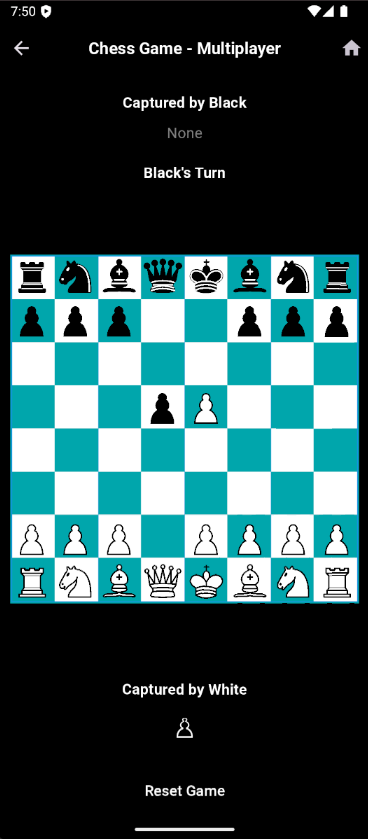
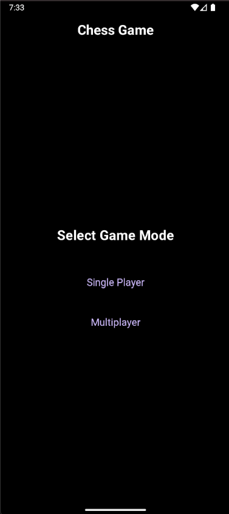

Developed a fully functional chess game using Flutter and Dart. The game supports both single-player and two-player modes. It also includes a feature to track captured pieces for better game analysis.

## Screenshots

  
  

